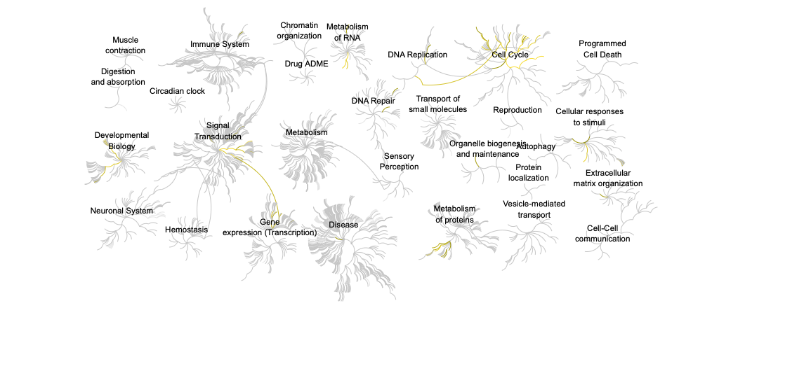

## Background 

The data for today's mini-project comes from a knock-down study of an important HOX gene. 

Our intention is typically to use such lists to gain novel insights about genes and proteins that may have roles in a given phenomenon, phenotype or disease progression. However, in many cases these 'raw' gene lists are challenging to interpret due to their large size and lack of useful annotations. Hence, our expensively assembled gene lists often fail to convey the full degree of possible insight about the condition being studied.

## Data Import 

```{r}
countData <- read.csv("GSE37704_featurecounts.csv", row.names = 1)
colData <- read.csv("GSE37704_metadata.csv", row.names = 1)
```

Have a small peek at these: 
```{r}
head(countData)
```

```{r}
head(colData)
```

### Clean up (data tidying)

The rows don't line up so we need to remove one! 

We also need to exclude a row specifically genes! 

```{r}
colnames(countData) == rownames(colData)
```

## DESeq analysis 

The rows don't line up so we need to remove one! 
```{r}
countData <- as.matrix(countData[, -1])
head(countData)
```

We also need to exclude a row specifically genes! 

```{r}
countData = countData[rowSums(countData) > 0, ]
head(countData)
```

```{r, message = FALSE}
library(DESeq2)
```

### Setting up the DESeq object

```{r}
dds <- DESeqDataSetFromMatrix(countData= countData,
                             colData= colData,
                             design=~ condition)
```

## Running DESeq 

```{r}
dds = DESeq(dds)
dds
```

### Getting results 

```{r}
res = results(dds)
summary(res)
```

## Volcano Plot

```{r}
library(ggplot2)

ggplot(res) +
  aes(log2FoldChange,
      log2(padj)) +
  geom_point()
```

## Add Annotation 

```{r}
# Make a color vector for all genes
mycols <- rep("gray", nrow(res) )

# Color blue the genes with fold change above 2
mycols[ abs(res$log2FoldChange) > 2 ] <- "blue"

# Color gray those with adjusted p-value more than 0.01
mycols[ res$padj > 0.01 ] <- "gray"

ggplot(res) +
  aes(log2FoldChange,
      -log2(padj)) +
  geom_point(col = mycols) +
  xlab("Log2(FoldChange)") +
  ylab("-Log(P-value)") +
  geom_vline(xintercept = c(-2,2), col ="red") +
  geom_hline(yintercept = -log10(0.05), col = "red")
```

```{r}
library("AnnotationDbi")
library("org.Hs.eg.db")

columns(org.Hs.eg.db)

res$symbol = mapIds(org.Hs.eg.db,
                    keys= rownames(res), 
                    keytype="ENSEMBL",
                    column= "SYMBOL",
                    multiVals="first")

res$entrez = mapIds(org.Hs.eg.db,
                    keys= rownames(res),
                    keytype="ENSEMBL",
                    column="ENTREZID",
                    multiVals="first")

res$name =   mapIds(org.Hs.eg.db,
                    keys=row.names(res),
                    keytype= "ENSEMBL",
                    column= "GENENAME",
                    multiVals="first")

head(res, 10)
```

Writing the CSV file! 

```{r}
res = res[order(res$pvalue),]
write.csv(res, file ="deseq_results.csv")
```


## Pathway Analysis 

Here we are going to use the gage package for pathway analysis. Once we have a list of enriched pathways, we're going to use the pathview package to draw pathway diagrams, shading the molecules in the pathway by their degree of up/down-regulation.

### KEGG

We first need to load the required packages! 

```{r}
library(pathview)
library(gage)
library(gageData)

data(kegg.sets.hs)
data(sigmet.idx.hs)

# Focus on signaling and metabolic pathways only
kegg.sets.hs = kegg.sets.hs[sigmet.idx.hs]

# Examine the first 3 pathways
head(kegg.sets.hs, 3)
```

With the gage function we: 

```{r}
foldchanges = res$log2FoldChange
names(foldchanges) = res$entrez
head(foldchanges)
```

```{r}
# Get the results
keggres = gage(foldchanges, gsets=kegg.sets.hs)
attributes(keggres)
```
```{r}
head(keggres$less)
```

Taking one gene to analyze: 

```{r}
pathview(gene.data=foldchanges, pathway.id="hsa04110")
```


 It can be displayed in various ways
 
```{r}
# A different PDF based output of the same data
pathview(gene.data=foldchanges, pathway.id="hsa04110", kegg.native=FALSE)
```
 Focus on top 5 upregulated pathways here for demo purposes only
 
```{r}
keggrespathways <- rownames(keggres$greater)[1:5]

# Extract the 8 character long IDs part of each string
keggresids = substr(keggrespathways, start=1, stop=8)
keggresids
 
```
 
```{r}
pathview(gene.data=foldchanges, pathway.id=keggresids, species="hsa")
```


### GO

We can also do a similar procedure with gene ontology. Similar to above, go.sets.hs has all GO terms. go.subs.hs as displayed with this code. 

```{r}
data(go.sets.hs)
data(go.subs.hs)

# Focus on Biological Process subset of GO
gobpsets = go.sets.hs[go.subs.hs$BP]

gobpres = gage(foldchanges, gsets=gobpsets)

lapply(gobpres, head)
```

### Reactome

Reactome is database consisting of biological molecules and their relation to pathways and processes. Reactome, such as many other tools. 


```{r}
sig_genes <- res[res$padj <= 0.05 & !is.na(res$padj), "symbol"]
print(paste("Total number of significant genes:", length(sig_genes)))
```

```{r}
write.table(sig_genes, file="significant_genes.txt", row.names=FALSE, col.names=FALSE, quote=FALSE)
```



> Q. What pathway has the most significant “Entities p-value”? Do the most significant pathways listed match your previous KEGG results? What factors could cause differences between the two methods?

Cell Cycle, miotic has the most significant "Entities p-value". They match with the previous KEGG results as it is also listed first in the table with it being second to lowest. The differences that could cause this is maybe different prioritization in methods what can modify the p-value and what is listed on the respective methods. 