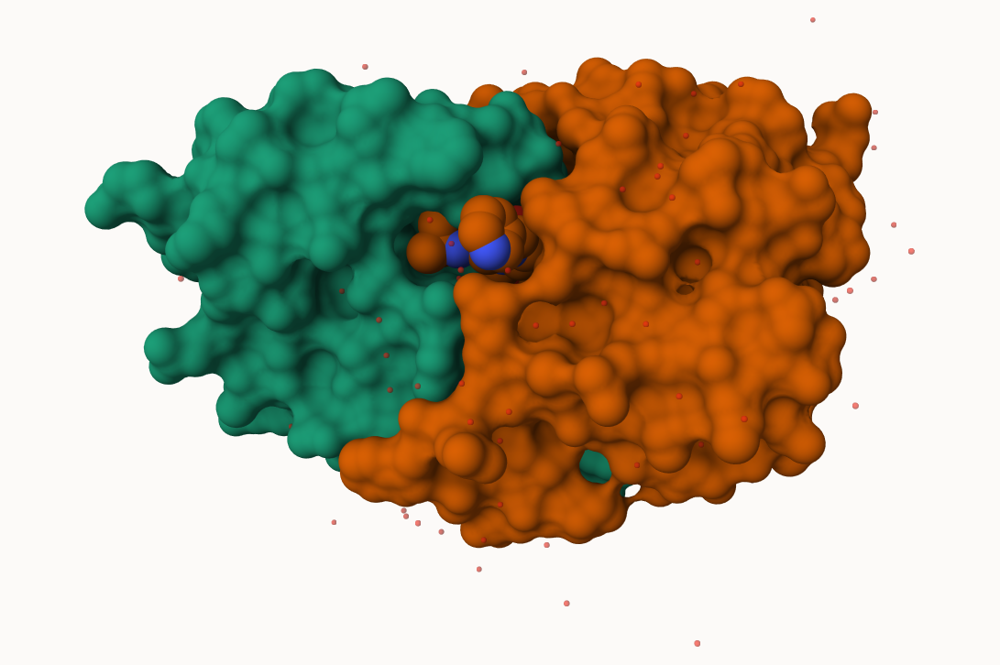
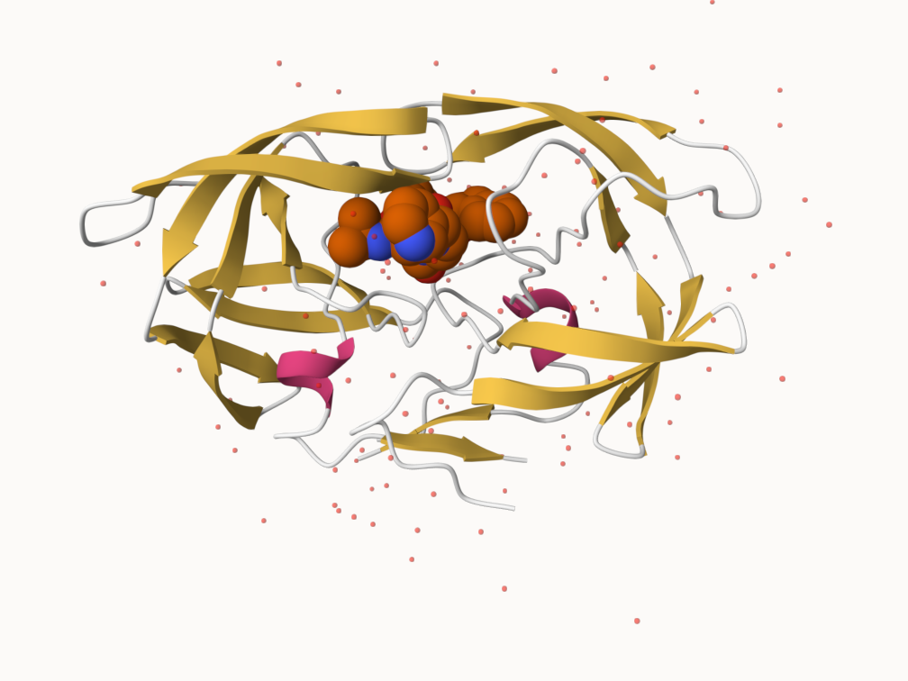
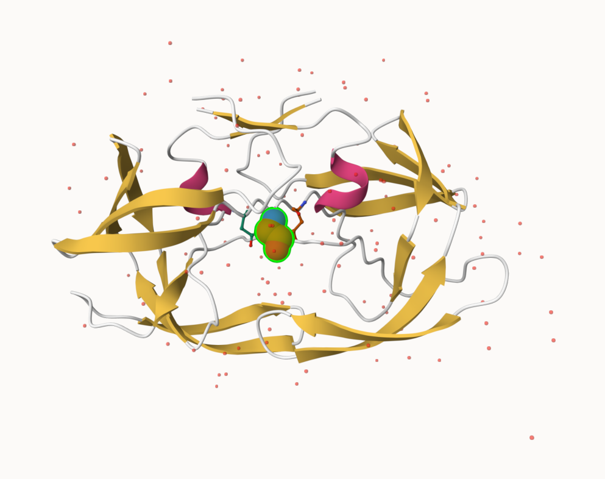

## The PDF database
 
 The [Protein Data Bank (PDB)](https://www.rcsb.org/) is the main repository of biomolecular structure data . Let's see what is in it: 
 
 > Q1: What percentage of structures in the PDB are solved by X-Ray and Electron Microscopy.

The percentage of PDB solved X-Ray Microscopy is 81% and by Electron Microscopy is 13%. 

```{r}
structures <- read.csv("pdbstats26", row.names = 1)
structures
```

```{r}
n.sums <- colSums(structures)
n <- n.sums/n.sums["Total"]
round(n, digits = 2)
```

> Q2: What proportion of structures in the PDB are protein? 

```{r}
n.sums <- colSums(structures)
round((n.sums/n.sums["Total"] * 100), digits = 2)
```

```{r}
round(structures["Protein (only)",]$Total/n.sums['Total'] * 100, digits = 2)
```


> What is the total number of entries in the PDB? 

```{r}
n.sums["Total"]
```

## Using Molstar 

We can use the main [Molstar viewer online](https://molstar.org/viewer/.):



> Q. Generate and insert an image of the HIV-Pr cartoon colored by secondary structure, showing the inhibitor (ligand) in spacefill.



> Q. Generate one final image showing catalytic APS25 as ball and stick and the all-important active site water molecule as spacefill. 



## The Bio3D package for structural bioinformatics

```{r}
library(bio3d)

hiv <- read.pdb("1hsg")
hiv
```

```{r}
head(hiv$atom)
```

```{r}
pdbseq(hiv)
```

Let's try out the new **bio3dview** package that is not yet on CRAN. We can use the **remotes** package to install any R package from GitHub. 

### Quick viewing of PDBs 

```{r}
library(bio3dview)

sele <- atom.select(hiv, resno = 25)

#view.pdb(hiv, backgroundColor = "pink",
#        highlight = sele, highlight.style = "spacefill")
```

### Prediction of Protein flexibility 

```{r}
adk <- read.pdb("6s36")
m <- nma(adk)
plot(m)
```

Write out our resultsas a small trajectory movie: 

```{r}
mktrj(m, file="adk_m7.pdb")
```

```{r}
#view.nma(m)
```

## Comparative Protein structure analysis with PCA 

We'll start with a database ID ("1ake_A)

```{r}
library(bio3d)
id <- "1ake_A"
aa <- get.seq(id)

```

```{r}
blast <- blast.pdb(aa)
```

have a small peek! 
```{r}
head( blast$hit.tbl)
```

```{r}
hits <- plot(blast)
```

```{r}
head( hits$pdb.id)
```

Now we can download these "top hits" these will all be ADK  

```{r}
files <- get.pdb(hits$pdb.id, path = "pdbs", split = TRUE, gzip = TRUE)
```

We need one package from BioConductor. To set this up we need to first install a package called **"BiocManager"** from CRAN. 

Now we can use the `install()` function from this package like this: `BiocManager::install("msa")`

```{r}
pdbs <- pdbaln(files, fit = TRUE, exefile = "msa")
```

Let's have a small peek at our structures after "fitting" or superposing: 

```{r}
library(bio3dview)
#view.pdbs(pdbs, colorScheme = "residue")
```

We can run functions like `rmsd()`, `rmsf()`, and the best `pca()`

```{r}
pc.xray <- pca(pdbs)
plot(pc.xray)
```

```{r}
plot(pc.xray, 1:2)
```

Finally, let's make a small movie of the major "motion" or structural difference in the dataset - we call this a "trajectory"

```{r}
mktrj(pc.xray, file = "results.pdb")
```

