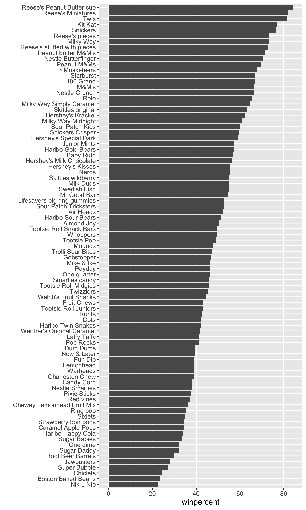
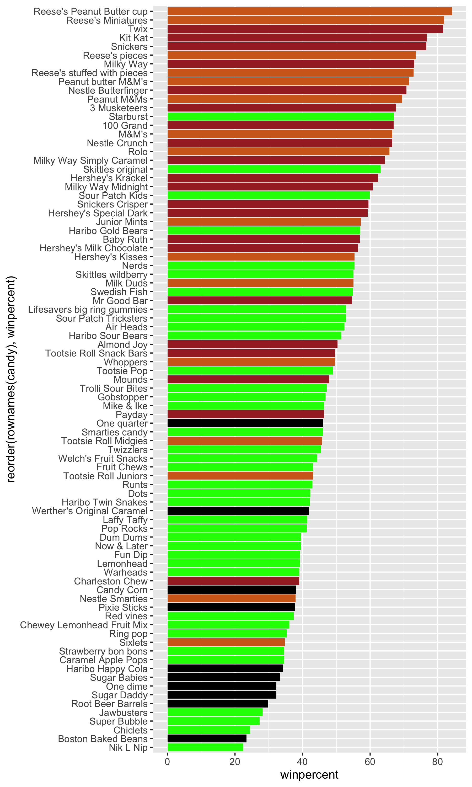

## Background
In today's mini-project we will analyze candy data with the exploratory graphics, basic statistics, correlation analysis and principal component methods we have studied thus far! 

## Data Import
First we need to import the csv file for the candy data! 

```{r}
candy_file <- "candy-data.csv"
candy = read.csv(candy_file, row.names = 1)
head(candy)
```

> Q1. How many different candy types are in this dataset?

```{r}
nrow(candy)
```

> Q2. How many fruity candy types are in the dataset?

```{r}
sum(candy[ ,"fruity"])
```

> Q3. What is your favorite candy (other than Twix) in the dataset and what is it’s winpercent value?

```{r}
candy["3 Musketeers", ]$winpercent
```


> Q4. What is the winpercent value for “Kit Kat”?

```{r}
candy["Kit Kat", ]$winpercent
```
> Q5. What is the winpercent value for “Tootsie Roll Snack Bars”?

```{r}
candy["Tootsie Roll Snack Bars", ]$winpercent
```

We can quickly install skim to quickly observe out data! 

```{r}
library("skimr")
skim(candy)
```

> Q6. Is there any variable/column that looks to be on a different scale to the majority of the other columns in the dataset?

The win percentage column seems to be on a different scale than the rest of the data set because of its absurdly large whole numbers in comparison to the others which are below 1. 


> Q7. What do you think a zero and one represent for the candy$chocolate column?

```{r}
candy$chocolate
```
I think the `candy$chocolate` column serves as a function for whether or not the column has chocolate. The 1 would represent the set having chocolate, while the 0 would be false and not have any chocolate within it. 

## Exploratory Analysis 

Plotting Histograms for the data set. 

> Q8. Plot a histogram of winpercent values using both base R an ggplot2.

```{r}
hist(candy [ ,"winpercent"])

```

```{r}
library(ggplot2)
ggplot(candy, aes(x = winpercent)) + geom_histogram(bins = 20)
```

> Q9. Is the distribution of winpercent values symmetrical?

No the distribution is not symmetrical. 

> Q10. Is the center of the distribution above or below 50%?

The center of distribution appears to be at 50%.

```{r}
mean(candy$winpercent)
```


> Q11. On average is chocolate candy higher or lower ranked than fruit candy?

```{r}
choc.candy <- candy[ candy$chocolate ==1, ]
choc.win <- choc.candy$winpercent
mean(choc.win)
```
```{r}
fruit.candy <- candy [ candy$fruity == 1 ,]
fruit.win <- fruit.candy$winpercent
mean(fruit.win)
```

From both of the averages calculated from the means it seems to be that chocolate candy on average is more higher ranked than fruity candy.  

> Q12. Is this difference statistically significant?

```{r}
t.test (choc.win, fruit.win)
```
 
 No true difference in the calculated means that this data is statistically significant. 

## Overall Candy Rankings


> Q13. What are the five least liked candy types in this set?

```{r}
inds <- order(candy$winpercent)
head(candy[inds, ], 5)
```

> Q14.  What are the top 5 all time favorite candy types out of this set?

```{r}
head(candy[order(candy$winpercent, decreasing=TRUE),], n = 5)
```

> Q15. Make a first barplot of candy ranking based on winpercent values.

```{r}
ggplot(candy) + aes ( winpercent, rownames(candy)) + geom_col() + ylab("") # turn off Y-label that we don't need! 

ggsave("barplot1.png", height =10, width = 6)
```


> Q16. This is quite ugly, use the reorder() function to get the bars sorted by winpercent?

```{r}
library(ggplot2)

ggplot(candy) + aes (winpercent, reorder(rownames(candy), winpercent)) + geom_col() + ylab("") # turn off Y-label that we don't need! 
                     
ggsave("barplot2.png", height =10, width = 6)
```



Let's add some color to this plot! 

```{r}
my_cols=rep("black", nrow(candy))
my_cols[as.logical(candy$chocolate)] = "chocolate"
my_cols[as.logical(candy$bar)] = "brown"
my_cols[as.logical(candy$fruity)] = "green"

ggplot(candy) + 
  aes(winpercent, reorder(rownames(candy),winpercent)) +
  geom_col(fill=my_cols) 

ggsave("barplot3.png", height =10, width = 6)
```



> Q17. What is the worst ranked chocolate candy?

The worst ranked chocolate candy is Sixlets. 

> Q18. What is the best ranked fruity candy?

The best ranked fruity candy is Starburst. 

## Taking a look at PricePercent 

We had to install the ggrepel package in `install.packages("ggrepel")` for better label placement! 

```{r}
library(ggrepel)

# How about a plot of win vs price
ggplot(candy) +
  aes(winpercent, pricepercent, label=rownames(candy)) +
  geom_point(col=my_cols) + 
  geom_text_repel(col=my_cols, size=3.3, max.overlaps = 5)
```

> Q19. Which candy type is the highest ranked in terms of winpercent for the least money - i.e. offers the most bang for your buck?

The candy type that offers the most bang for your buck from the displayed graph above seems to be Reese's Miniatures (chocolate). 

> Q20. What are the top 5 most expensive candy types in the dataset and of these which is the least popular?

```{r}
ord <- order(candy$pricepercent, decreasing = TRUE)
head( candy[ord,c(11,12)], n=5 )
```
Nik L P seems to be the least popular! 


## Exploring the correlation structure 

Pearson correlation values range from -1 to +1 

```{r}
library(corrplot)
cij <- cor(candy)
corrplot(cij)

```

> Q22. Examining this plot what two variables are anti-correlated (i.e. have minus values)?

Fruity Candies and Chocolate are anti-correlated as evidenced by the red dot in their intersection in the displayed plot. 

> Q23. Similarly, what two variables are most positively correlated?

Chocolate Candies are Win Percent are the most positively correlated as displayed by the blue plot in their intersection in the displayed plot above. 

## Principal Component Analysis 

ˆ
```{r}
pca <- prcomp(candy, scale = T)
summary(pca)
```

The main results figure: the PCA score plot:

```{r}
ggplot(pca$x) + aes (PC1, PC2, label = rownames(pca$x)) + geom_point(col = my_cols) + geom_text_repel(col = my_cols) + labs(title = "PCA Candy Space Map")
```

> Q24. Complete the code to generate the loadings plot above. What original variables are picked up strongly by PC1 in the positive direction? Do these make sense to you? Where did you see this relationship highlighted previously?

```{r}
ggplot(pca$rotation) + aes(PC1, rownames(pca$rotation)) + geom_col()
```

Chocolate, Bar, and Win Percent are all picked up in the PC1 displayed above in the positive direction. This is entirely logical to me and this is displayed in the corr plot we made previously for correlation.  


## Summary 
> Q25. Based on your exploratory analysis, correlation findings, and PCA results, what combination of characteristics appears to make a “winning” candy? How do these different analyses (visualization, correlation, PCA) support or complement each other in reaching this conclusion?

A winning candy seems to be dependent on whether it has an, win percent, bar, and price percent. It being chocolate is also super popular and would contribute to that. They would compliment each other in this conclusion as the graphs we have displayed for correlation highly points out Win Percent, Price Percent, and the type of chocolate that would contribute to this conclusion. As well as the PCA we have displayed above. 